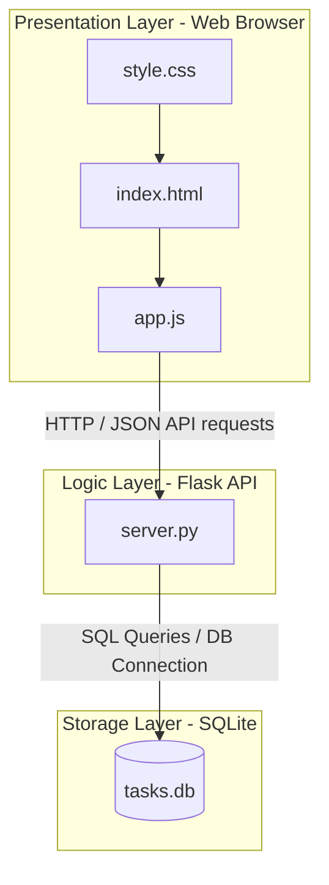

# System Architecture

The Collaborative Task Dashboard utilizes a classic 3-tier architecture designed for lightweight local deployments.

## Architectural Components

### 1. Presentation Layer (Frontend)
- **HTML5 & CSS3**: Pure, structural markup combined with modern responsive styling. Features a premium glassmorphic dark UI.
- **JavaScript (ES6+)**: Handles UI events, manipulates the DOM in real time, and sends HTTP requests via the Fetch API.

### 2. Business Logic Layer (Backend)
- **Python / Flask**: A lightweight REST API server that routes HTTP requests to specific controller methods. It manages connections to the SQLite database and formats data transfers in JSON.
- **CORS Handling**: Uses `flask-cors` to allow cross-origin requests from frontend pages running on different local ports or directly from the file system.

### 3. Storage Layer (Database)
- **SQLite**: A file-based, relational database engine. Highly efficient for local demonstrations and testing, eliminating database setup overhead.
